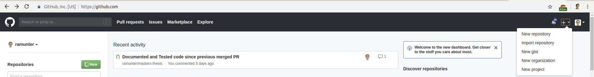
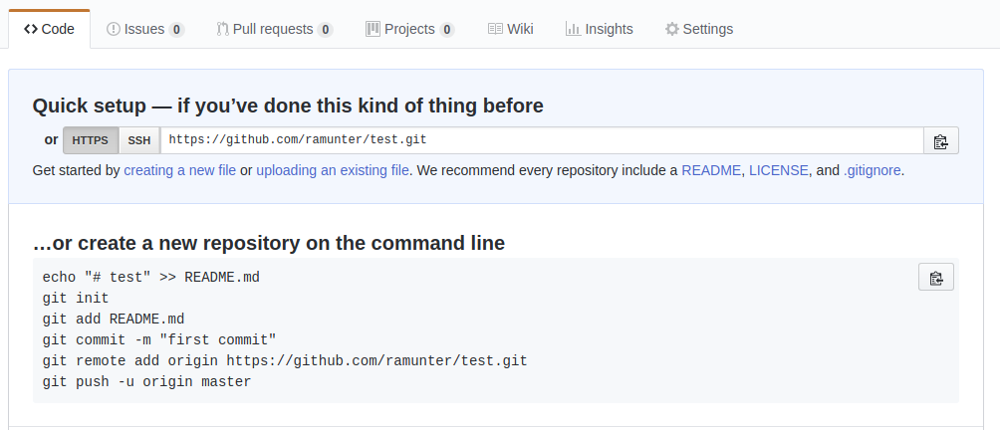
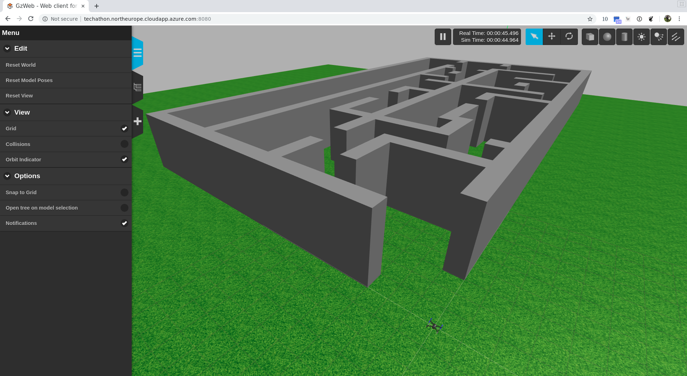

# Getting Started

This guide will guide you through setting up the project. To do this we will go through 3 steps.

1. Connect to the virtual machine on Azure.
2. Setup a github repository.
3. Run the simulator and an example script.


## Connecting to your virtual machine

Your team should have received an address and a password to the virtual machine(VM). This allows you to connect to the server using the SSH command. Follow the guide for your operating system.

**Important:** For security reasons, ensure that you are connected to a VPN before connecting to the VM.

### Windows

1. Open up PuTTY.

2. Write your teams address in the Host Name field. Don't change the port number.


3. Click open. If you get a prompt asking if you are sure that you want to connect click yes.

4. A terminal should open with a password prompt.

5. Enter your teams password.

### Mac OS / Linux

1. Open up a terminal.

2. run `ssh techathon@<your-teams-address>`. If you get a prompt asking if you are sure that you want to connect click yes.

3. Enter your teams password.

---

If your command line starts with `techathon@<server-name>:~/equinor_hackathon_2019/catkin_ws/src/techathon/src$` your terminal is now running on the virtual machine! Note that no matter what your computer is running, this connected terminal is running Ubuntu 18.


##  Setup a github repository.

The steps that follow assume that you have completed the above and are in the VM terminal with the starting line `techathon@<server-name>:~/equinor_hackathon_2019/catkin_ws/src/techathon/src$`. 

Type `ls` into the terminal and you should see that we have left a few files to help you along the way.

To coordinate work with your group and to transfer code from your computer to the VM you will use Github. The next few steps will explain how to create a repository containing the scripts we provide.

1. Create a new repository

Go to `www.github.com`. In the top right corner there should be a `+`. Click this and click `New Repository`.



2. Give your repository a name and decide if you want it to be public or private. Click create repository.

If you decided to have a private repository note that you'll have to create a personal access token to interact with the repository from the virtual machine. [A guide to doing this can be found here](https://help.github.com/en/articles/creating-a-personal-access-token-for-the-command-line]).

3. Follow the "…or create a new repository on the command line" instructions. **Important:** use `git add .` instead of `git add README.md`.

You will get a prompt requiring you to set your email and name. Follow the instructions that pop up with this prompt.



Thats it! You are now ready to run the simulator.

## Run the simulator with an example program
By now you know how to connect to the server and get terminal access to it. We will now use this to start the simulator and view its output in real time. 
1. Get terminal access by following the above guide. The steps below assume you are typing commands into the servers terminal. 

2. Start the simulator

The simulator is started through ROS, which is a robotics software framework. You don't need any knowledge about it other than knowing it exists. To start the simulator, run 
```
roslaunch techathon main.launch
```
This command starts the physics simulator, loads a world with a maze and a drone, and sets up a webserver for connecting to it through the browser. If this command is successful, you should see alot of text shown on the screen and the terminal will be blocked.

3. Viewing the simulator

Once the simulator is running, it can be accessed through a web browser on your computer. 
In a webbrowser, open up `http://<your-teams-address>:8080`. You should see a green grass plane with a drone and a maze in the middle. Use you cursor to look around. Note that to orient the camera on a laptop, you need to hold down shift while left-clicking. 


4. Running the example

To run the example we need a new terminal connection to the server. Open up a new connection the same way as in step 1. We will run the example `controlled_takeoff.py`, which is explained in [example](examples.md). While the simulator is running in the other terminal, run the command
```
rosrun techathon controlled_takeoff.py
```
When doing this the propellers on the drone should start to spin, and after a few seconds the drone will takeoff and fly to a random point. 

5. Turning off the simulator

To stop the simulator, open up the terminal it is running in and press `CTRL+c`. Do the same to turn off your own program if it doesn't stop by itself. 


## Next step
Now that you know how to access the simulator and run programs on it, you are ready to take on the [Equinor drone challenge](task.md). Good luck!

