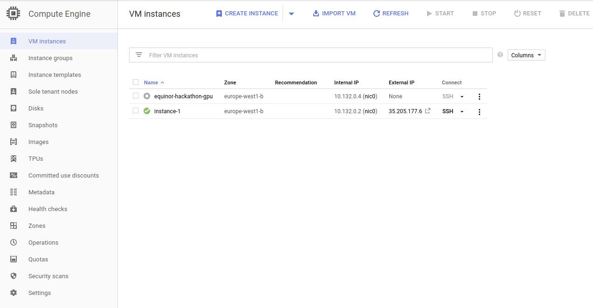
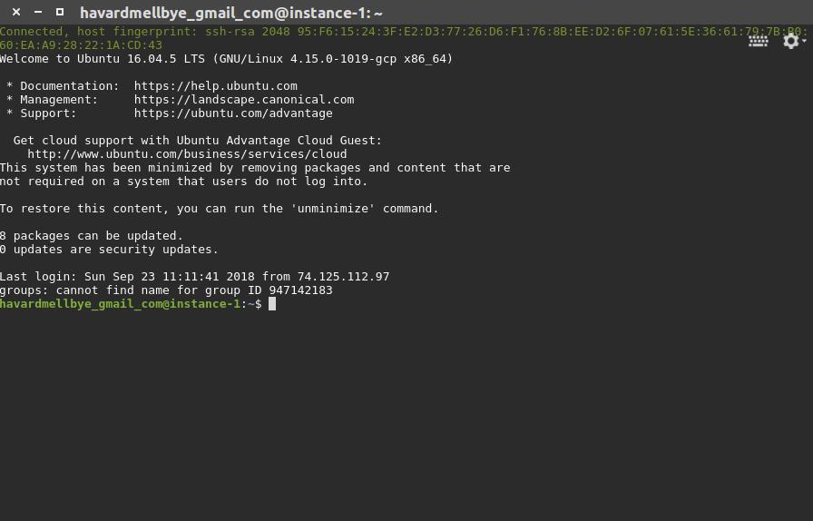
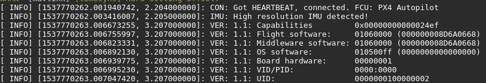
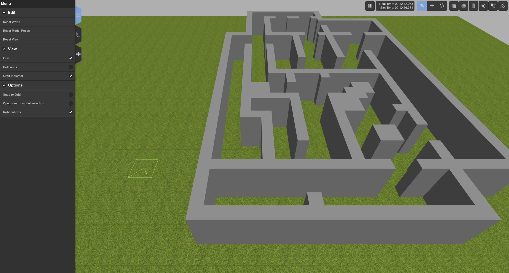

# How to use the simulator

## Step 1: Access Google Cloud Compute Engine

The servers are rented from Google Clouds Compute Engine. Follow this [link](https://console.cloud.google.com/compute/instances?project=equinor-hackathon) to login and view all available instances. You should end up here, but with other instaces named after your team.
The `SSH` button will open a remote connection to the server using SSH and will give you a terminal in your browser you can use as a normal linux terminal. The `External IP` is the IP address the simulator will be available at on port 8080.




## Step 2: Open a SSH terminal to your server

There is one instance running for all teams, named accordingly. Login to your server by clicking on the `SSH` button and wait while google cloud transfers your credentials to the server. 



## Step 3: Login to your shared team user

The simulation tools are set up to be used by one user only, named `team`. Google Cloud will provide all new users with their own username, so you have to switch user to get access to the simulation tools. We've created a script to make this easier. To switch to the user `team`, run this from your home directory.

``` bash
source start.sh
```  

## Step 4: Start the simulator

The simulator is started by running the start sim command.

For task 1

``` bash
start_sim task1
```

For task 3

``` bash
start_sim task3
```


The simulator is running when you receive a heartbeat from the flight controller, which looks like this:



The script will launch multiple applications at once. If the script is stopped before all applications are running (before the heartbeat), it might result in `zombie processes` which are processes that are difficult kill. These processes can interfere with the simulator, so we recommend rebooting the server if the simulator misbehaves, by running

``` bash
sudo reboot
```

## Step 5: Access the simulation output in a web browser

The `External IP` found in google cloud is the address where the server will output the results. Copy that address (only the raw IP, remove any prefixes like HTTPS). The server can be access by navigation to `EXTERNAL_IP:8080` in your browser, where `EXTERNAL_IP` is the IP you copied.

When the page has loaded (it takes a few seconds), you should see a 3D rendered world where you can move around.


## Step 6: Stopping the simulator when you're done

The simulator can be stopped like any other foreground linux process by `Ctrl-C` on your keyboard. 

## A few disclaimers:

- The simulation seems to tolerate multiple viewers at once, but we can't guarantee it. Try to limit the amount of connections.
- The simulatiors web client is based on a open source project currently in development. There might be some bugs that can occurr. We recommend doing a reboot (using `sudo reboot`) if something seems off.
- The simulator requires near real time perfomance to get accurate physics. The servers are extremely powerfull (way more computing power than you can excpect to get on a drone), but if your algorithms use too much CPU it might affect the simulation.
