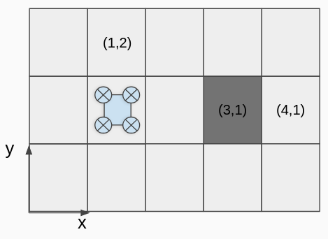

# Task

## Task Overview

The aim of the Equinor drone challenge is to autonomously maneuver a drone through a maze to a goal point. A map of the maze is provided in the beginning of the run as a 2D array (see below) and we provide a library that can move the drone around at fixed altitude.

We have provided the following 4 maps.

* `static` - A simple maze.
* `static_boost` - A maze with areas that provide a time boost.
* `dynamic` - A maze with obstacles that move randomly around the map.
* `dynamic_boost` - A maze with obstacles and time boosts.

In each map the aim is to reach the goal point as quickly as possible. Each map will have its own scoreboard and it's up to your team if you want to complete each map together or try to split up the work. 

### Rules

1. The drone must __not fly higher than__ `3.5 meters`. The drone library described below allows arbitrary control of the height, which can be useful for testing. But for the attempt to count, your drone must never fly higher than 3.5 meters. 

2. The maze must not be modified. It is possible to move and delete objects in the simulator, but doing so will mean that the current attempt doesn't count toward the leaderboard. 

3. For a score to count it must be reproducible by the organizers. 

4. The last rule is to not break the spirit of the competition, ie. don't cheat, dont break other teams solutions, etc. If you are unsure about if doing something might break this rule, ask the organizers!

### Scoring

Teams are scored based on the time taken to reach the goal. During the competition the leaderboard will be updated based on teams results on the given maps.

### Running a task

The provided `main.py` file is a template where you can write your code. See below for details about the useful variables and functions in the file. 

Running an attempt on a map is similar to running the examples. To do so you will need 2 terminals with SSH into the VM. Run the following commands in their own terminal.

1. `roslaunch techathon main.launch world_name:=<map_name>`
2. `rosrun techathon main.py`

The timer starts once the drone takes off.

If you want to have seperate code for each map feel free to create new `.py` files that follow the same template as `main.py`. Note that you then need to run the correct .py file with rosrun.

## Code details

The following section gives an overview of some of the key variables and functions used. In addition we have provided a few example files. Checkout the example section for a walkthrough the examples.

### Useful variables

`global_map` is a double indexed array with matrix indexing. In other words to access coordinate (x,y) call global_map[y][x].

`goal` is a struct that defines a point in space defined by 3 coordinates: x,y and z. In this case only x and y will be defined. This defines the position the drone should navigate to.

`obstacles` is an array of `Pose` values. It contains the position of all obstacles that move, and is updated continously. To get the position of an obstacle, use `obstacles[0].position`.

`boosts` is an array of `Pose` values. The x and y of each element define the position of the time boost bonus. Going close to these points will give a 15 second time bonus. 

### Provided map
The map provided is a 2-dimensional array of zeroes and ones, where 1 means that there is a wall, and 0 means no wall. 
Note that if the map says `global_map[1][3] = 1`, meaning y=1 and x=3 is a wall, then there is a wall on the grid from (x,y)=(3,1) to (x,y)=(4,2), since the wall is atleast 1x1 meter in size!

If the map says that `global_map[1][4] = 0`, then there is no wall at y=1, x=4. This means that a safe position is x=4.5 and y=1.5! See the illustration below.



### Drone API

To simplify communication with the drone, a small drone API is provided. It is a class that contains variables about the drones position and gives high-level access to navigation functions. An overview is provided below.

```python
from dronelib import Drone

"""Create the drone link"""
drone = Drone()

"""Takeoff. Note that this will start the competition timer."""
drone.takeoff() 

"""
Set a position target in xy-plane with height 2 meters. Set yaw orientation to 
and angle between -pi and pi. The drone will blindly go to this target, and
hold it's position when it gets there.
"""
drone.set_target(x, y)

"""
Get the x coordinate of the drone.
"""
x = drone.position.x
```

It is important to note that all operations sent to the drone need some time to complete. This means that although the takeoff function `drone.takeoff()` returns quickly, the actual takeoff operation in the simulator may take several seconds to complete. The same is true for `drone.set_target(x,y)`. 


### Note about movement precision
Expect some position offset when arriving at a target! 

The drone lives in a physics simulator which simulates environment noise. It is controlled by an emulated flight controller which runs state of the art flight controller software. Because of these factors, the drone does not always fly perfectly and generally doesn't perfectly hit the target setpoint. 
